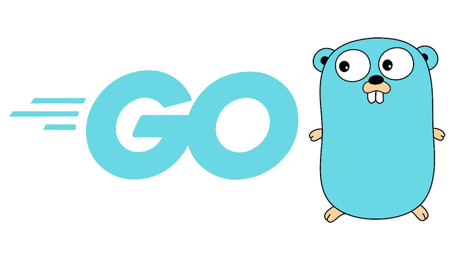

<div align="center">


#

</div>

<div align="center">

# <b>KLYNTAR</b> - a decentralized ecosystem of services for Web2 & Web3. Using a rich set of technologies and our knowledge, we are going to focus on solving a wide range of problems

</div>

<br/><br/><br/><br/>

<div align="center">

### UPD: It's not a ready solution. It's Golang implementation of Node.js core (voting thread)

</div>

<br/><br/><br/><br/>

# How to build

## Go installation

<div align="center">



</div>

First of all you need to install Golang. Or, check if you already have Go

```sh
go version
```

## After all

Now, clone the core repository

```sh
git clone https://github.com/KlyntarNetwork/KlyntarCoreGolang.git

cd KlyntarCoreGolang
```

### Build the core

Find `build_scripts/build.sh`. Run:

```bash
./build.sh
```

# Prepare configuration and genesis files

Now, you need 2 things to run your node and join some network:

1. Genesis file
2. Configuration for your node

To see how to setup it follow [here](https://docs.klyntar.org/deep-dive-into-kly/run-kly-node#prepare-configuration-and-genesis-files)


<div name="advice"></div>

## 🤓 <b>Advice</b>
<br/>
<p>
Follow us to get the news & updates ASAP. Discuss, share ideas, advices, help newbies to make our community more powerful.We're happy to involve new members to KLY community 😊
</p>

<br/>

<a href="https://www.reddit.com/r/KlyntarNetwork/">  
  
</a>
<a href="https://twitter.com/KlyntarNetwork">
  
</a>
<a href="https://klyntar.medium.com/">
  
</a>

<br/>

<a href="https://www.instagram.com/KlyntarNetwork/">
  
</a>
  <a href="https://dev.to/klyntar">
  
</a>
<a href="https://github.com/KlyntarNetwork">
  
</a>

<br/>

<a href="https://t.me/KlyntarNetwork">
  
</a>
<a href="https://discord.gg/f7e7fCp97r">
  
</a>
<a href="http://klyntar66kjwhyirucco6sjgyp2f7lfznelzgpjcp6oha2olzb4rlead.onion">
  
</a>
<a href="https://www.youtube.com/channel/UC3TiyK40an6rQlf3BarMDoQ">
  
</a>

<br/>

<a href="https://www.facebook.com/KlyntarNetwork">
  
</a>
<a href="https://gitlab.com/KLYNTAR">
  
</a>
<a href="">
  
</a>

<br/><br/>


<div name="docs"></div>

## 📚<b>Docs</b>

Read the docs here to find out more. For example, how to use plugins, prepare & change configs, run on a host machine, how to start a KLY Service and so on!